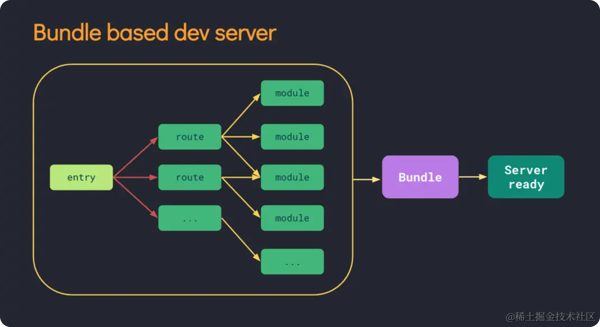
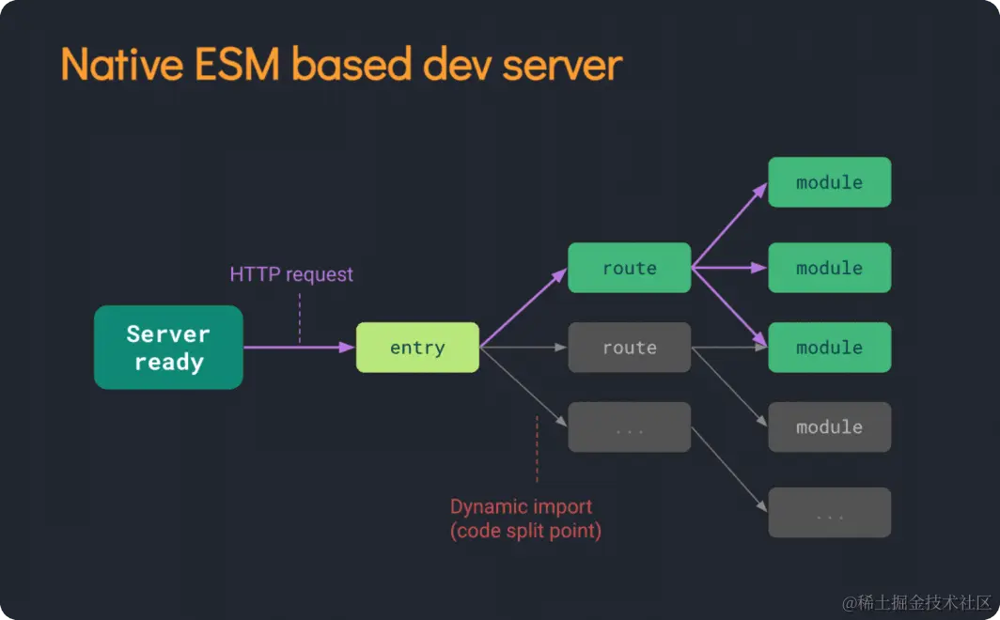
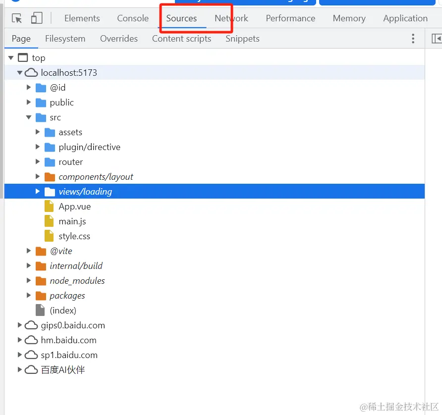

## webpack 运行原理
示意图：

### 当项目启动时 webpack 会根据我们的配置文件webpack.config.js 的入口文件分析项目所有的依赖，然后打包成一个依赖 bundle.js 交给浏览器去渲染 这样就带来一个问题项目越大启动时间越长

## vite 运行原理

-   vite 运行时，会先读取vite.config.js的配置文件
-   启动开发服务器这个服务器基于原生的Es模块，允许浏览器请求资源而无需打包，所以大大加快了开发环境的启动速度
-   模块转化会使用它的内置Vue插件@vuejs/plugin-vue将.vue文件转化为浏览器可以识别的代码
-   模块热更新 当你的文件更新时vite 会使用websocket向客户端发送更新 然后在不刷新页面的情况下 用修订过的模块替换旧模块
-   依赖预构建：为了加快页面加载速度 vite会预构建编译所有的依赖， 会在node_module 文件夹下缓存一个.vite的文件夹
## 先理解下ES module
-   现代浏览器大部分支持Es module 即  然后直接使用import 引入对应的js 文件
vite 也正是利用了es module 的特性 使用vite 运行项目时先会用esbuild 进行 预构建，将所有模块转为 es module，不需要我们对整个项目进行编译打包，而是在
浏览器需要加载某个模块时，拦截浏览器发出的请求，根据请求按需编译然后返回给浏览器。

## 构建方式
-   webpack 是基于node.js构建的而vite则是基于esbuild进行预构建的
-    vite 在加载时 才会构建编译 （可以在谷歌浏览器source 中去查看）---- 但是这也有个缺点  本地开发 切换路由的时候  页面反应贼慢 emm..

## 热更新处理
-   在webpack中当一个模块或者依赖的模块内容变化时 需要重新编译这些模块
-   在vite中当某个内容改变时 只需让浏览器重新请求该模块即可 

##  vite 和 babel 的关系

-   在开发环境中，Vite 不使用 Babel 转译代码。Vite 采用的是基于浏览器原生 ES 模块（ESM）的开发方式。它直接利用现代浏览器的原生支持，并通过 esbuild 来进行快速的 TypeScript、JSX、以及其他现代 JavaScript 语法的转译。esbuild 是一个超快速的 JavaScript 打包工具，Vite 使用它来替代 Babel 进行转译，因而在开发环境中通常不需要 Babel。

-   在生产环境下，Vite 使用 Rollup 进行打包。虽然 Rollup 是一个非常灵活且强大的打包工具，但它本身不负责代码转译。Vite 默认情况下依然使用 esbuild 进行代码转译，因为它比 Babel 更快。
如果你需要特定的 Babel 插件或功能（例如使用一些 Babel 插件来处理特定的代码转换需求），你可以手动配置 Babel 与 Vite 一起使用。在这种情况下，你可以在 Vite 配置文件中集成 Babel，但 Vite 默认并不依赖 Babel。

## 为什么 Vite 项目没有 Babel 插件也能运行？
现代浏览器和 ES6+ 语法：

-   Vite 的目标是针对现代浏览器和 ES6+ 的代码，因此它依赖于现代浏览器对原生 ESM 和现代 JavaScript 语法的支持。因为大多数现代浏览器已经支持这些语法，Vite 不需要 Babel 来进行旧版 JavaScript 语法的转换。
-   Vite 默认使用 esbuild 代替 Babel 进行编译，这比 Babel 更快，尤其在开发模式下，可以更快地启动和热更新。
不需要降级：

-   如果你的项目不需要支持较旧的浏览器（如 IE11），Vite 可以直接输出现代 JavaScript 代码而不经过 Babel 的降级处理