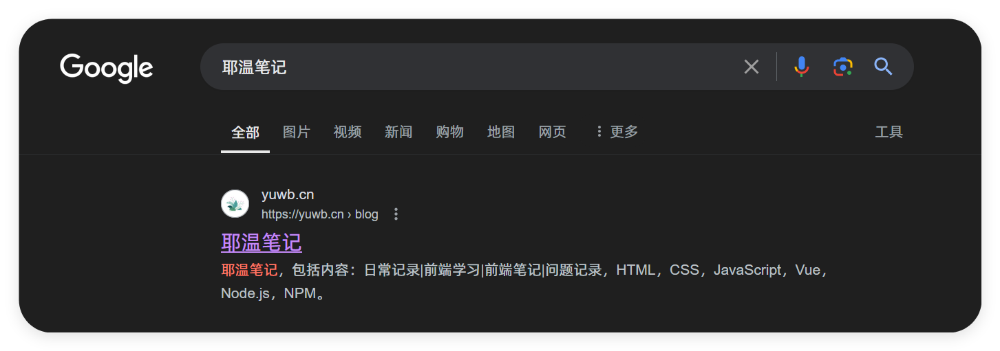

# 网站优化-SEO

## 网站标题和描述

网页的标题（`<title>`）和 描述（`<meta name="description">`）。

网站标题和描述是搜索引擎优化（SEO）中非常重要的元素，它们直接影响到搜索引擎结果页面（SERP）中的展示效果和用户的点击率。


```html
<title>如何进行有效的SEO优化 | 前端笔记</title>
<meta name="description" content="了解如何通过有效的SEO策略提升网站排名，吸引更多流量。立即访问获取更多信息！">
```

**网站标题**

-   网站标题是网页的主要标题，通常显示在浏览器标签和搜索引擎结果中。

-   优化建议：
    -   长度：标题的最佳长度通常在50到60个字符之间，确保在搜索结果中完整显示。
    -   关键词：将主要关键词放在标题的前面，确保与页面内容相关。
    -   品牌：如果有品牌，可以在标题的末尾添加品牌名称。
    -   吸引力：标题应具有吸引力，能够引起用户的兴趣，鼓励他们点击。
    -   唯一性：每个页面的标题应独特，避免重复，以帮助搜索引擎区分不同页面。

示例：

```html
<!-- 不佳，需要优化 -->
<title>首页</title>

<!-- 最佳 -->
<title>如何进行有效的SEO优化 | 前端笔记</title>
```

**网站描述**
-   网站描述是对网页内容的简要总结，通常显示在搜索引擎结果页面的标题下方。

-   优化建议：
    -   长度：描述的最佳长度通常在150到200个字符之间，确保在搜索结果中完整显示。
    -   关键词：将主要关键词放在描述的前面，确保与页面内容相关。
    -   行动号召：使用行动号召（如“立即了解”、“获取更多信息”等）来鼓励用户点击。
    -   清晰简洁：描述应清晰、简洁，准确反映页面内容，避免误导用户。
    -   唯一性：每个页面的描述应独特，确保与页面内容相关。
示例：

```html
<!-- 不佳，需要优化 -->
<meta name="description" content="网站优化-SEO">

<!-- 最佳 -->
<meta name="description" content="了解如何通过有效的SEO策略提升网站排名，吸引更多流量。立即访问获取更多信息！">
```


**搜索示例**

搜索引擎会根据网站标题和描述进行搜索，因此需要确保标题和描述的准确性和相关性。



## 语义化标签

语义化标签是HTML5引入的一种标签，它们通过明确的标签名称来描述内容的意义和结构，从而使得网页的内容更易于理解和解析。这不仅有助于搜索引擎优化（SEO），还提高了网页的可访问性和可维护性。

-   语义标签：尽量使用HTML5的语义标签（如 `<header>`、`<nav>`、`<article>`、`<section>`、`<footer>`等）来清晰地定义页面结构。

-   标题标签：合理使用`<h1>`到`<h6>`标签，确保每个页面有一个唯一的`<h1>`标签，包含主要关键词，其他标题标签用于分层次地组织内容。

-   内容标签：使用合适的内容标签（如`<p>`、`<ul>`、`<ol>`、`<li>`、`<table>`、`<div>`等）来组织和描述页面内容。

**参考列表**

- `<header>`：定义页面或区段的头部。

- `<nav>`：定义导航链接。

- `<main>`：定义页面的主要内容。

- `<article>`：定义独立的文章内容。

- `<section>`：定义文档中的一个区段。

- `<aside>`：定义与页面主内容少关的内容。

- `<footer>`：定义页面或区段的底部。

- `<h1> - <h6>`：定义标题。


## 页面加载速度


### 优化图片大小和格式

优化图片大小和格式是提升网页性能和用户体验的重要步骤。根据不同的设备像素比（DPR，Device Pixel Ratio）提供不同的图片格式，可以确保在不同设备上显示清晰的图像，同时减少不必要的带宽消耗。

1. 图片格式选择

-   WebP：现代格式，支持有损和无损压缩，通常比JPEG和PNG更小，且质量更高。（浏览器支持的情况下，优先选择）
-   SVG：适合图标和简单图形，基于矢量，不会失真。
-   PNG：适合需要透明背景的图像，支持无损压缩，但文件较大。
-   JPEG：适合照片和复杂图像，支持有损压缩，文件较小。

::: tip  无损压缩 有损压缩
有损压缩（Lossy Compression）：有损压缩是一种通过丢弃一些图像数据来减小文件大小的压缩方法。这种压缩方式会导致图像质量的下降，尤其是在高压缩比的情况下。
无损压缩（Lossless Compression）：无损压缩是一种在压缩过程中不丢失任何图像数据的压缩方法。压缩后的图像可以完全还原为原始图像。
:::

2. 根据DPR提供不同图片

可以使用`<picture>`元素和`<source>`标签来根据设备的DPR提供不同的图片格式和大小。

```html
<picture>
    <!-- 针对高DPR设备提供WebP格式 -->
    <source srcset="image-2x.webp 2x, image-1x.webp 1x" type="image/webp">
    <!-- 针对高DPR设备提供JPEG格式 -->
    <source srcset="image-2x.jpg 2x, image-1x.jpg 1x" type="image/jpeg">
    <!-- 默认图片 -->
    
</picture>
```

3. 响应式图片

除了根据DPR提供不同格式的图片，还可以使用 `srcset` 和 `sizes` 属性来提供不同分辨率的图片。

```html

```

-   `srcset`：定义不同分辨率的图像及其宽度。
-   `sizes`：告诉浏览器在不同条件下应该使用哪个图像。例如，`(max-width: 600px) 100vw`表示在屏幕宽度小于`600px`时，使用100%的视口宽度的图像。


### 使用CDN加载资源

内容分发网络（CDN，Content Delivery Network）是一种通过分布在不同地理位置的服务器来加速网站内容交付的技术。使用 CDN 加载资源可以显著提高网站的加载速度和性能，这对搜索引擎优化（SEO）至关重要。搜索引擎（如 Google等）倾向于优先考虑加载速度快、用户体验良好的网站，因此使用 CDN 可以间接提高网站的搜索排名。

1. 加载插件资源
```html
<head>
    <meta charset="UTF-8">
    <meta name="viewport" content="width=device-width, initial-scale=1.0">
    <title>使用 CDN 加载资源</title>
    <!-- 使用 Bootstrap 的 CDN -->
    <link rel="stylesheet" href="https://stackpath.bootstrapcdn.com/bootstrap/4.5.2/css/bootstrap.min.css">
    <!-- 使用 jQuery 的 CDN -->
    <script src="https://code.jquery.com/jquery-3.5.1.slim.min.js"></script>
    <!-- 使用 Bootstrap 的 JavaScript CDN -->
    <script src="https://stackpath.bootstrapcdn.com/bootstrap/4.5.2/js/bootstrap.bundle.min.js"></script>
</head>

```
2. 加载图片

```html

```

除此之外，我们也可以把我们的网站，部署到CDN上，这样可以减少服务器的负载，提高页面加载速度。


### 压缩代码和资源

-   压缩代码和资源文件，减少此类文件大小，减少HTTP请求数。

1. 代码压缩

-   借助代码压缩工具，将HTML，CSS和JavaScript进行压缩，减小文件大小，提高加载速度。
-   如果使用Webpack，vite或者其他构建工具，可以使用插件自动压缩代码和资源文件。

2.  减少 HTTP 请求数

-   合并文件：将多个 CSS 或者 JavaScript 文件合并为一个文件。
-   CSS Sprites：将多个小图片合并为一张大图片，通过 CSS 背景定位来显示不同部分。


```html
<head>
    <!-- 压缩合并后的 CSS 文件 -->
    <link rel="stylesheet" href="styles.min.css">
    
    <!-- 压缩合并后的 JavaScript 文件 -->
    <script src="scripts.min.js"></script>
</head>
```


### 缓存资源文件
缓存资源文件是提高网站性能和用户体验的重要策略。通过合理配置缓存，可以减少服务器负担，加快页面加载速度，从而对搜索引擎优化（SEO）产生积极影响。缓存可以通过浏览器缓存、CDN 缓存和服务器端缓存等方式实现。

-   浏览器缓存

浏览器缓存允许用户的浏览器在首次访问网站时下载资源文件，并在后续访问时直接从本地缓存中加载这些文件，而不是每次都向服务器请求。这可以通过设置 HTTP 头部来实现。

-   CDN缓存

使用 CDN（内容分发网络）可以将资源文件缓存到离用户更近的服务器上，从而加快加载速度。大多数 CDN 提供自动缓存和缓存控制功能。

-   服务器缓存

服务器端缓存可以通过使用缓存插件或配置服务器来实现。


### 内容懒加载
内容懒加载（Lazy Loading）是一种优化技术，可以延迟加载网页中的某些内容（如图片、视频和其他资源），直到用户滚动到该内容的位置。这种方法可以显著提高页面加载速度，减少初始加载时间，从而改善用户体验和 SEO。

-   `LazyLoad.js`：轻量级的懒加载库，易于使用且兼容性好。


```html
<!-- 引入 -->
<script src="https://cdnjs.cloudflare.com/ajax/libs/vanilla-lazyload/17.1.0/lazyload.min.js"></script>

<!-- 使用 -->

<script>
document.addEventListener("DOMContentLoaded", function() {
    var lazyLoadInstance = new LazyLoad({
        elements_selector: ".lazy"
    });
});
</script>
```

-   `lazysizes`： 是一个功能强大的懒加载库，支持图片、iframe 和其他资源的懒加载。

```html
<!-- 引入 -->
<script src="https://cdnjs.cloudflare.com/ajax/libs/lazysizes/5.3.2/lazysizes.min.js" async=""></script>

<!-- 使用 -->

<iframe data-src="https://example.com" class="lazyload"></iframe>

```
-   `IntersectionObserver`：原生方法。是一个 JavaScript API，用于检测元素是否进入视口。

```html


<script>
const images = document.querySelectorAll('img.lazy');
const options = {
    root: null, // 使用视口作为根元素
    rootMargin: '0px',
    threshold: 0.1 // 交叉比例
};
const lazyLoad = (image) => {
    image.src = image.dataset.src;
    image.classList.remove('lazy');
};
const observer = new IntersectionObserver((entries, observer) => {
    entries.forEach(entry => {
        if (entry.isIntersecting) {
            lazyLoad(entry.target);
            observer.unobserve(entry.target);
        }
    });
}, options);
images.forEach(image => {
    observer.observe(image);
});
</script>
```


## 图片具名

在前端开发中，图片的具名化是指为图片文件和相关属性（如替代文本）提供清晰、描述性和优化的命名方式。这一过程对于搜索引擎优化（SEO）至关重要，因为它帮助搜索引擎理解图片内容，从而提高网页在搜索结果中的排名。此外，良好的图片具名化也能改善用户体验，尤其是对于使用屏幕阅读器的用户。

```html

```

**主要注意项**
-   文件名：使用描述性和关键词丰富的文件名。
-   替代文本（alt text）：为每张图片提供简洁明了的替代文本，描述图片内容。


